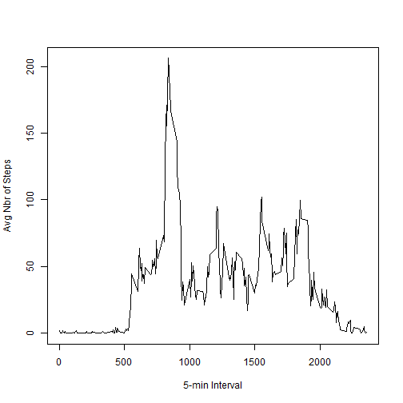

```r
library(ggplot2)
library(stringr)
library(lattice)
```

## Loading and preprocessing the data

#### 1. Load the data 
Data is in file: activity.csv (assuming the file is unzipped and in current working dir)

```r
activ <- read.csv(file = "activity.csv",header = TRUE)
```

#### 2. Process/transform data
Convert the Date variable from factor class to date class

```r
activ$date <- as.Date(activ$date, "%Y-%m-%d")
```

## What is mean total number of steps taken per day?

#### 1. Calculate the total number of steps taken each day
Aggregate the number of steps taken by day

```r
stepsbyday <- tapply(activ$steps, activ$date, sum, na.rm=TRUE)
```
#### 2. Make a histogram of the total number of steps taken each day

```r
qplot(stepsbyday, xlab='Steps per day', ylab='Frequency (binwidth = 500)', binwidth=500)
```

 

#### 3. Calculate and report the mean and median of the total number of steps taken each day

```r
meanSteps <- mean(stepsbyday)
medianSteps <- median(stepsbyday)
```

* Mean is 9354.2295082
* Median is 10395

## What is the average daily activity pattern?

```r
stepsbyinterval <- aggregate(steps~interval, data=activ, FUN = mean)
names(stepsbyinterval)[2] <- "meanstepsbyinterval"
```

#### 1. Make a time series plot (i.e. type ="l") of the 5-minute interval (x-axis) and the averages across all days (y-axis)

```r
plot(x = stepsbyinterval$interval, y = stepsbyinterval$meanstepsbyinterval, type = "l", xlab = "5-min Interval", ylab = "Avg Nbr of Steps")
```

 

#### 2. Which 5-minute interval, on average across all the days in the dataset, contains the maximum number of steps?
Identify which interval has the most steps

```r
maxSteps <- which.max(stepsbyinterval$meanstepsbyinterval)
maxInterval <- stepsbyinterval$interval[maxSteps]
```
Display that maximum interval in Hours / Minutes (more elegant)

```r
hrsmins <- str_pad(maxInterval, 4, side = c("left"), pad = " ")
hours <- substr(hrsmins, 1,2)
mins <- substr(hrsmins, 3,4)
intervalhm <- gsub(" ","", paste(hours, ":", mins), fixed = TRUE)
```
Interval with maximum number of step: 8:35

## Imputing missing values

#### 1. Calculate and report the total number of missing values in the dataset (i.e. the total number of rows with NAs)

```r
navalues <- length(which(is.na(activ$step)))
```
Number of missing values (no steps recorded): 2304

#### 2. Devise a strategy for filling in all the missing values in the dataset
My chosen strategy for imputation is:
* Use the mean of steps by interval (stepsbyinterval) already determined above to impute.
* Then replace all NAs in the dataset by the means found for the corresponding interval.

#### 3. Create a new dataset that is equal to the original dataset but with the missing data filled in

```r
imputeddata <- activ
for (i in 1:nrow(imputeddata)) {
    if (is.na(imputeddata$steps[i])) {
        imputeddata$steps[i] <- stepsbyinterval[which(imputeddata$interval[i] == stepsbyinterval$interval), ]$meanstepsbyinterval
    }
}
```

#### 4. Make a histogram of the total number of steps taken each day and calculate and report the mean and median total number of steps taken by day. Do these values differ from the estimates from the first part of the assignment? What is the impact of imputing missing data on the estimates of the total daily number of steps?

**Histogram**

Aggregate the number of steps taken by day

```r
stepsbydayimputed <- tapply(imputeddata$steps, imputeddata$date, sum, na.rm=TRUE)
qplot(stepsbydayimputed, xlab='Steps per day', ylab='Frequency (binwith = 500)', binwidth=500)
```

 

**Mean and median total number of steps taken by day**

```r
meanStepsImputed <- mean(stepsbydayimputed)
medianStepsImputed <- median(stepsbydayimputed)
```
* Mean is: 10766.19  
* Median is: 10766.19  

**Values differ from estimates from first part?**  
**Difference between the imputed stats and mean and median (before imputation)**  


```r
format(meanStepsImputed - meanSteps, scientific = FALSE)
```
* Difference in Mean is 1411.959  


```r
format(medianStepsImputed - medianSteps, scientific = FALSE)
```
* Difference in Median is 371.1887  

**Impact if imputation on estimates of the total daily number of steps**  
* For days where they were NA values (Oct 1, Oct 8, Nov 1, No 4, Nov 9, Nov 10, Nov 14 and Nov 30), there is a great impact because the imputation give values to those days.  
* For days like October 2nd (lots of 0 values), imputation doesn't impact.  
* There is a greater impact on the mean than on the median.  
* Imputed values for the days with NAs become the most popular values (and therefore become the value of new Median after imputation).  

## Are there differences in activity patterns between weekdays and weekends?

#### 1. Create a new factor variable in the dataset with 2 levels - "Weekday" and "Weekend" indicating whether a given date is a week day or weekend day


```r
imputeddata$dateindex <- as.POSIXlt(imputeddata$date)$wday + 1
imputeddata$dayfactor <- ifelse(imputeddata$dateindex %in% c(1,7), 'Weekend', 'Weekday')
```

#### 2.Make a plot containing a time series plot (i.e. type = "l") of the 5-min interval (x-axis) and the average number of steps taken, then averaged across all weekday days or weekend days (y-axis). 


```r
aggs <- aggregate(imputeddata$steps, by = list(imputeddata$dayfactor, imputeddata$interval), FUN=mean)
names(aggs) <- c("dayfactor","interval","meansteps")
xyplot(meansteps ~ interval | dayfactor, data = aggs, type = "l", layout = c(1,2), xlab = "Interval", ylab = "Number of Steps")
```

 
